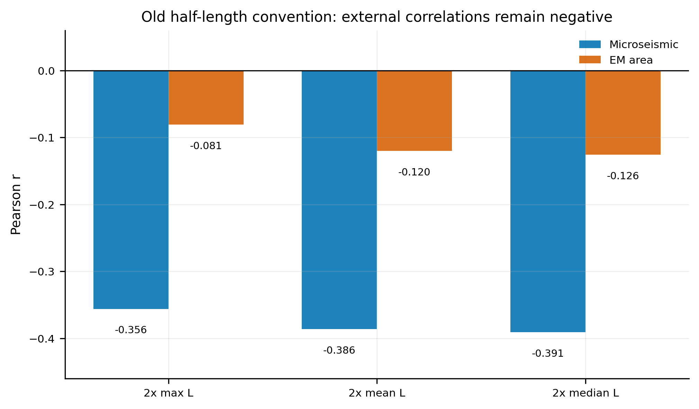
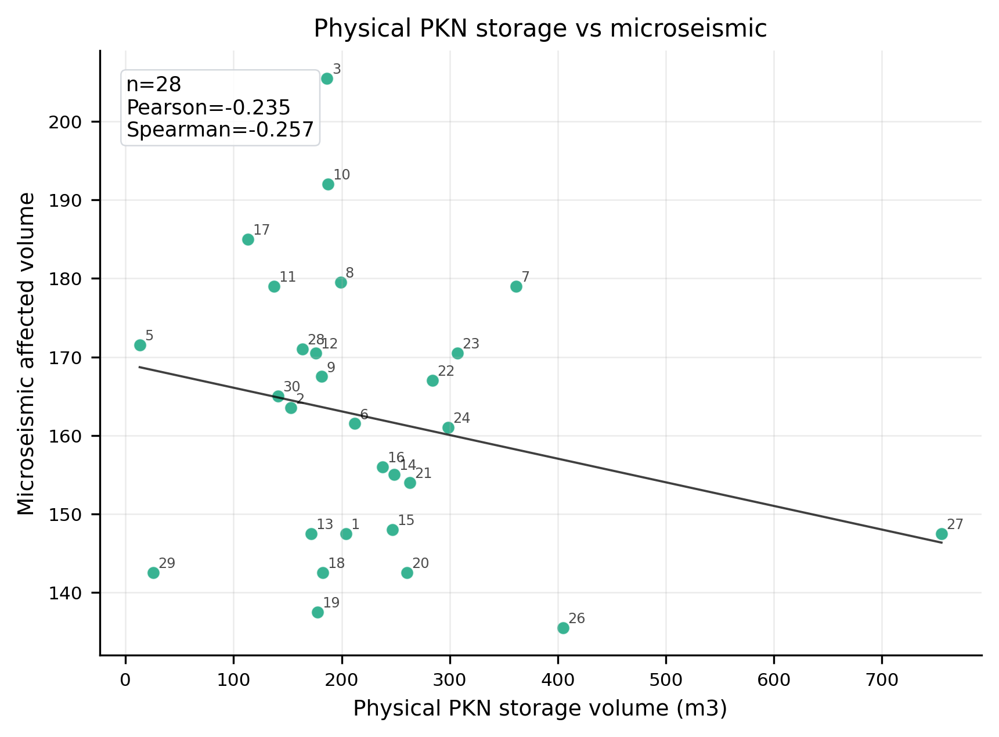
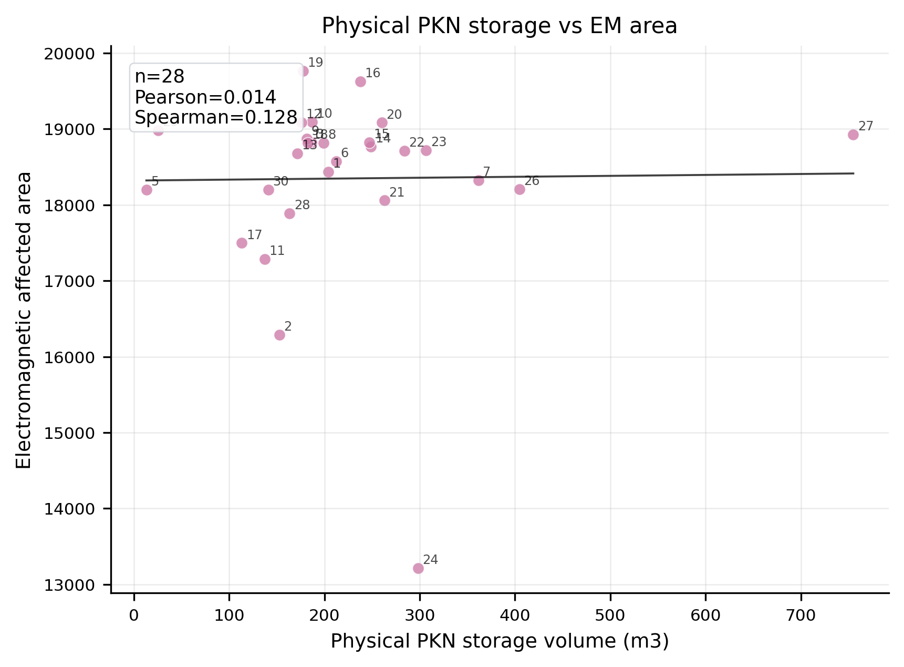
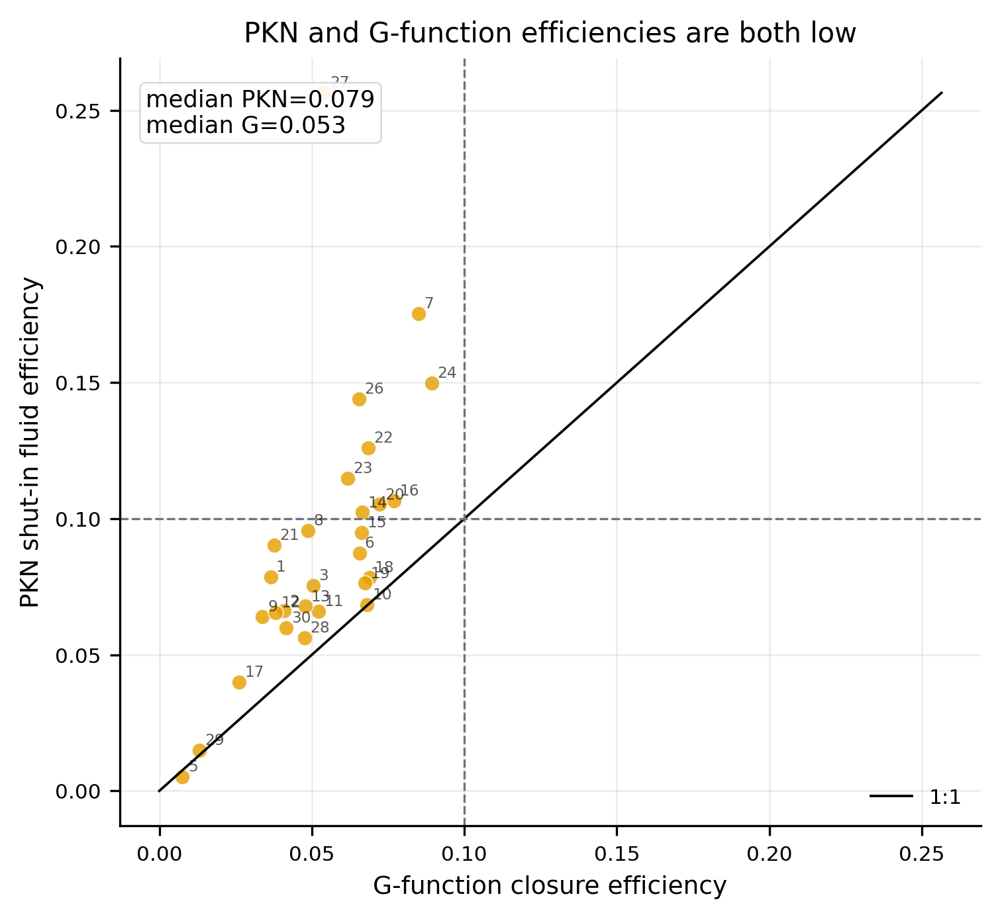
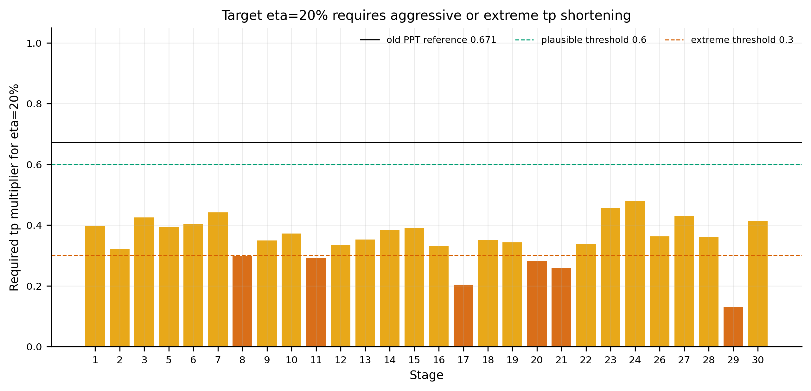
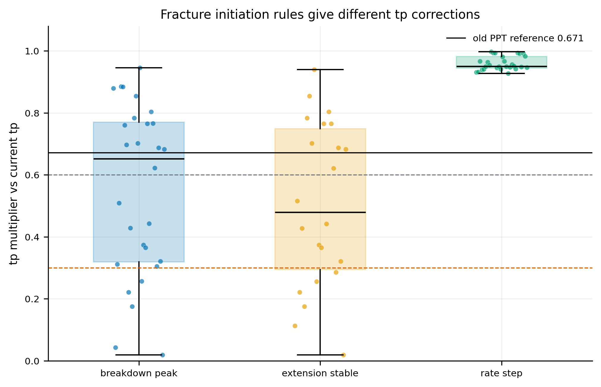

# Clotho sprint weekly report

## 本周核心结论

本周 sprint 的主线是把旧 PPT 的半缝长/体积口径，推进到可审计的
G-function closure、physical PKN storage、fluid-efficiency reconciliation、
tp reachability 和起裂时刻候选规则审计。所有结果仍是 candidate / diagnostic，
不是最终物理解释。

最重要的结果有三点。第一，旧半缝长口径和外部观测仍呈负相关：
`2x max/mean/median L` vs microseismic Pearson 分别为 `-0.356 / -0.386 / -0.391`，
vs EM area 分别为 `-0.081 / -0.120 / -0.126`。第二，physical PKN storage
在 28 个 computed stage 上对 microseismic 仍为负相关，Pearson 约 `-0.235`，
因此不能把 storage volume 直接写成外部波及体积的正向解释。第三，PKN shut-in
efficiency 和 G-function closure efficiency 都偏低，中位数分别约 `0.079` 和
`0.053`，核心问题转向 selected closure `G_c` 过低、valid window / tp / G-time
口径，而不是简单说 `C_stage` 系统性过大。



## 代码链路

本周代码链路已经从单一相关性表，扩展为可追踪的阶段级审计链：

1. `closure-batch` 生成 selected closure、G-time、stable segment 和 physical PKN
   stage summary。
2. `closure-efficiency-audit` 从 stage summary 派生 closure `G_c`、`tp`、效率和
   early-window 风险审计。
3. `closure-efficiency-sweep` 把经验效率 prior 反推成 target `G_c`，只作为
   sensitivity，不替代 closure pick。
4. `closure-tp-reachability-audit` 计算 target `G_c` 进入当前 valid window 所需的
   `tp_multiplier`。
5. `fracture-initiation-audit` 比较 pressure peak、extension stable 和 rate step
   三套起裂候选规则，并与 Phase 5J required multiplier 对照。

本周报提交的 `artifacts/` 只包含这些流程的派生 summary CSV，不包含原始井数据。

## Physical PKN storage 与外部观测

Physical PKN storage 使用当前项目的物理公式：

```text
V_f = pi * I_F / E' * L * H_w^2 * P_net
```

当前 full well 为 30 段，其中 28 段有 computed PKN 结果，stage 4/25 为 placeholder
或 missing estimate。28 个 computed stage 上：

- storage vs microseismic Pearson 约 `-0.235`，Spearman 约 `-0.257`；
- storage vs EM area Pearson 约 `0.014`，Spearman 约 `0.128`；
- leakoff / nonstorage vs EM area Pearson 约 `0.594`。

这些结果说明 storage volume 本身不是稳定的外部波及体积正相关解释。Leakoff /
nonstorage 与 EM 的正相关可以作为 sensitivity 线索，但不能写成 closure-efficiency
或最终物理结论。





## Storage / nonstorage / injected volume 口径差异

本周的一个关键边界是区分三类量：

- physical PKN storage volume：由 PKN 物理公式给出的裂缝储液体积；
- leakoff / nonstorage volume：由当前 leakoff 口径和体积平衡得到的非储液项；
- injected volume：施工注入体积，不等价于裂缝储液体积。

旧 PPT 或早期 MVP 中更像“注入量/经验长度”的变量，可能与外部观测更相关；但
canonical physical PKN storage 并未表现出同样关系。因此周报结论应写成“口径差异
导致解释方向变化”，而不是把任一口径当作唯一真值。

## 压裂液效率与 closure Gc

Phase 5H / 5H.1 的结果显示：

- PKN shut-in fluid efficiency min/median/max 约 `0.005 / 0.079 / 0.256`；
- G-function closure efficiency min/median/max 约 `0.008 / 0.053 / 0.089`；
- median PKN-G difference 约 `+0.028`；
- selected closure `G_c` min/median/max 约 `0.015 / 0.112 / 0.196`；
- 28/28 computed stages 的 selected `G_c < 0.2`。

因此低 efficiency 不是 PKN 单侧异常，也不能简单归因为 `C_stage` 过大。当前更合理
的解释方向是：selected closure candidate 的 `G_c` 很低，或者 `eta_G=G_c/(G_c+2)`
与当前 Nolte G-time 定义存在口径兼容性问题。该公式在本阶段只作为 diagnostic
cross-check。



## tp reachability

Phase 5J 定量回答了“是不是因为 `tp` 太大导致 `G` 太小”。由于当前 G-time 使用
`delta = elapsed / tp`，`tp` 越大，valid window 内可达到的 `G_c` 越小。Target
20% efficiency 对应 `G_c=0.5`，而当前 valid window 的可达 `G_c` 明显偏低。

对 target 20% efficiency，所需 `tp_multiplier` min/median/max 约为
`0.130 / 0.357 / 0.480`。这意味着所有 computed stages 都需要 aggressive 或
extreme 级别的 `tp` 缩短。与旧 PPT stage 1 的 `153/228≈0.671` sanity reference
相比，median `0.357` 过于激进，因此低 efficiency 不能只归因于普通起裂时刻修正。



## 起裂时刻三规则审计

Phase 5K 使用三套起裂候选规则：

- pressure peak：停泵前、`rate >= min_rate` 泵注段的最大压力点；
- extension stable：压力峰值后进入扩展压力平台的第一个稳定窗口；
- rate step：首次达到 `design_rate * rate_step_fraction` 的排量点。

规则级结果如下：

| rule | valid stages | multiplier min/median/max | eta10 reachable | eta20 reachable |
|---|---:|---:|---:|---:|
| breakdown peak | 28 | 0.019 / 0.652 / 0.945 | 25 | 7 |
| extension stable | 22 | 0.019 / 0.479 / 0.939 | 20 | 6 |
| rate step | 28 | 0.927 / 0.950 / 0.997 | 11 | 0 |

Pressure peak 的 median multiplier `0.652` 最接近旧 PPT `0.671` reference；
extension stable 的 median `0.479` 更激进，需要人工看图确认；rate step 接近当前
`tp`，无法解释 20% target。整体上，10% efficiency 可以部分由起裂修正解释，但
20% efficiency 仍缺乏普通起裂修正支持。



## 当前谨慎结论

本周不能写成“G-function 已证明模型正确”或“低 efficiency 已证明高漏失”。更准确的
结论是：

1. 旧半缝长口径和当前 physical PKN storage 口径给出不同解释方向。
2. Current selected closure `G_c` 全部偏低，是低 G-function efficiency 的直接数值原因。
3. `tp` 偏大确实会压低 G-time，但 20% efficiency 所需缩短幅度整体过于激进。
4. 起裂候选规则可以解释部分 10% target，但不能普遍支持 20% target。
5. 下周重点应转向人工复核 pressure/rate 曲线、valid falloff window、closure pick
   和 G-time 口径，而不是继续扩大普通参数网格。

## 下周计划

下周建议按优先级推进：

1. 对 high-priority stages `2, 3, 5, 9, 10, 11, 12, 17, 18, 19, 21, 26, 28, 29`
   画施工压力/排量曲线，人工确认 pressure peak 是否是真实 breakdown。
2. 对 extension stable 规则命中的 stage 复核稳定窗口是否只是算法窗口，而非真实扩展压力平台。
3. 复核 valid falloff window 是否过短，尤其是 target `G_c=0.5` 不可达的 stage。
4. 复核 `eta_G=G_c/(G_c+2)` 与当前 Nolte G-time implementation 的尺度兼容性。
5. 在人工复核前，不改变默认 `tp`、closure pick、PKN 公式、`I_F` 或 H_w。

## 数据与附件说明

本周报目录同步提交了 `figures/` 和 `artifacts/`：

- `figures/` 保存本周报用图；
- `artifacts/` 保存派生 summary CSV，用于追溯图表和核心数值；
- 未提交原始 well4 数据、`Gfunction-wells-current.zip` 或旧库 `gfunc/`；
- 所有结果仍为 candidate / diagnostic，不是最终解释。
